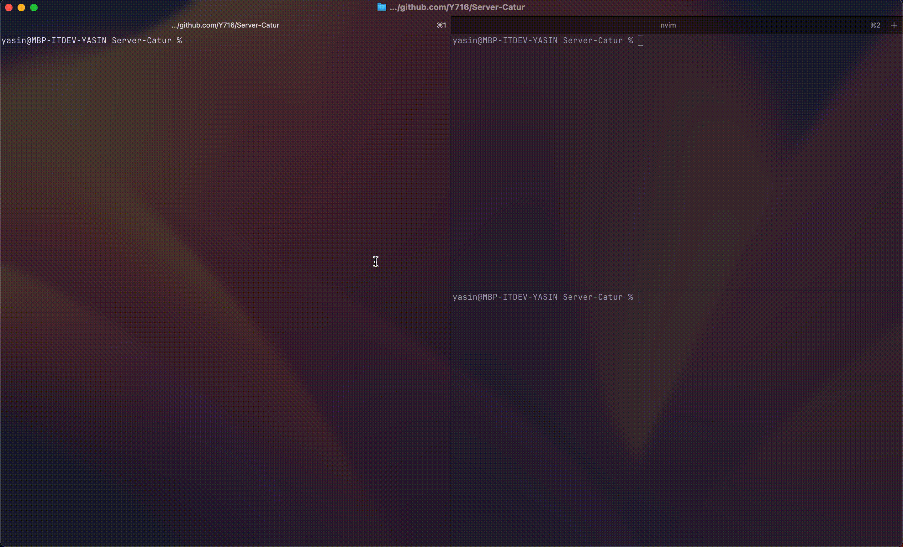

# Server-Catur
Playing chess... In your terminal! How cool is that?
Built with Go and websockets, you can play chess against your friends. Or if terminal isn't your taste, you can still play it in your browser too. We support concurrent games so multiple games can run at the same time without slowing each other down.

## Preview
Terminal Chess


## Diagram Architecture
```
 ┌──────────────────┐         ┌──────────────────┐
 │   CLI Client     │         │   Web Client     │ 
 │ (client/main.go) │         │ (client/web/)    │
 └────────┬─────────┘         └────────┬─────────┘
          │                            │
          │   WebSocket (/broadcast).  │
          └─────────────┬──────────────┘
                        │
                        ▼
              ┌─────────────────────┐
              │   Go HTTP Server    │
              │   (server/)         │
              │                     │
              │  /health  /games    │◄── REST (monitoring)
              │  /broadcast (WS)    │
              └──────────┬──────────┘
                         │
                         ▼
              ┌─────────────────────┐
              │   gameRooms map     │
              │  (matchmaking +     │
              │   room lookup)      │
              └──────────┬──────────┘
                         │
             ┌───────────┴───────────┐
             ▼                       ▼
      ┌──────────────┐        ┌──────────────┐
      │   Room #1    │  ...   │   Room #N    │
      │ Player1/2    │        │ Player1/2    │
      │ Board, Turn  │        │ Board, Turn  │
      └──────┬───────┘        └──────┬───────┘
             │                       │
             ▼                       ▼
      ┌────────────────────────────────────┐
      │     game/ package (logic)          │
      │     MovePiece · IsCheckmate        │
      │    IsStalemate · isKingInCheck     │
      └───────────────┬────────────────────┘
                      │
                      ▼
              ┌─────────────────┐
              │  board/ package │
              │  Board, Piece   │
              └─────────────────┘
```
## Prerequisites

1. go version 1.26.5 or up


## How to run

1. clone the repo


```
git clone https://github.com/Y716/Server-Catur.git
```

2. go to the root project directory


```
cd Server-Catur
```

3. Run the server


```
go run main.go
```

4. Run your client/player

On terminal

```
go run client/main.go
```

Or in browser, go to localhost:8080/

The PORT is automatically set to 8080. If you want to change, run the file with your designated PORT
on UNIX/Mac

```
PORT=8000 go run main.go
```

on Windows

```
set PORT=8000 && go run main.go
```

## Tech Stack & Why

**Go** — Chosen for its strong concurrency primitives (goroutines, channels) and 
simple, static-typed nature, which fit well with a networking-heavy backend project 
like a multiplayer game server. It's also a language well-suited for backend 
engineering portfolios.

**gorilla/websocket** — A mature, widely-used WebSocket library for Go. Rather than 
implementing the WebSocket protocol (handshake, framing, etc.) from scratch, this 
lets the project focus on the actual game logic and server architecture — the parts 
that matter more for demonstrating backend skills.

**In-memory state (no database)** — Game rooms and board state live in a `map[int]*Room` 
in server memory, not a database. This keeps the project focused on core backend 
concepts — concurrency, state management, and networking — without the added surface 
area of a persistence layer. The trade-off: state doesn't survive a server restart, 
which is an acceptable limitation for this project's scope (a live multiplayer session, 
not a service requiring durability).

**Goroutines + mutexes for concurrency** — Each player connection runs in its own 
goroutine, and every `Room` has its own `sync.Mutex` protecting its board/turn state. 
This means multiple games run fully in parallel — a move in one game never blocks or 
waits on another. A separate mutex protects the `gameRooms` map itself, guarding 
matchmaking (room creation/lookup) without serializing gameplay across rooms.

**Plain WebSocket + JSON (no framework)** — Messages between client and server are 
plain JSON objects with a `type` field (`Move`, `Turn`, `Board`, `Resign`, `GameOver`, 
`Color`). No RPC framework or protocol buffers — just enough structure to keep client 
and server in sync, which also makes the protocol easy to inspect and debug (e.g. via 
browser dev tools or `websocat`).

